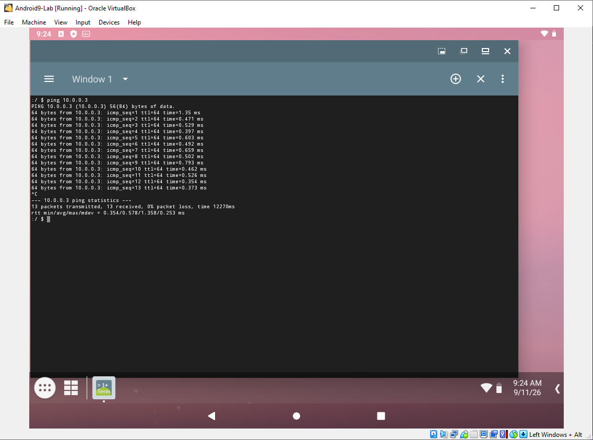
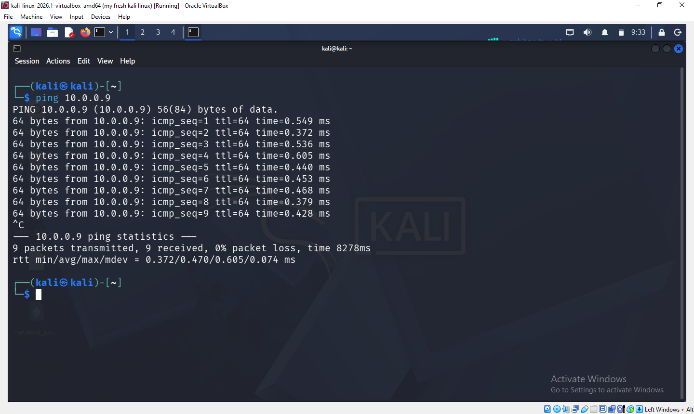
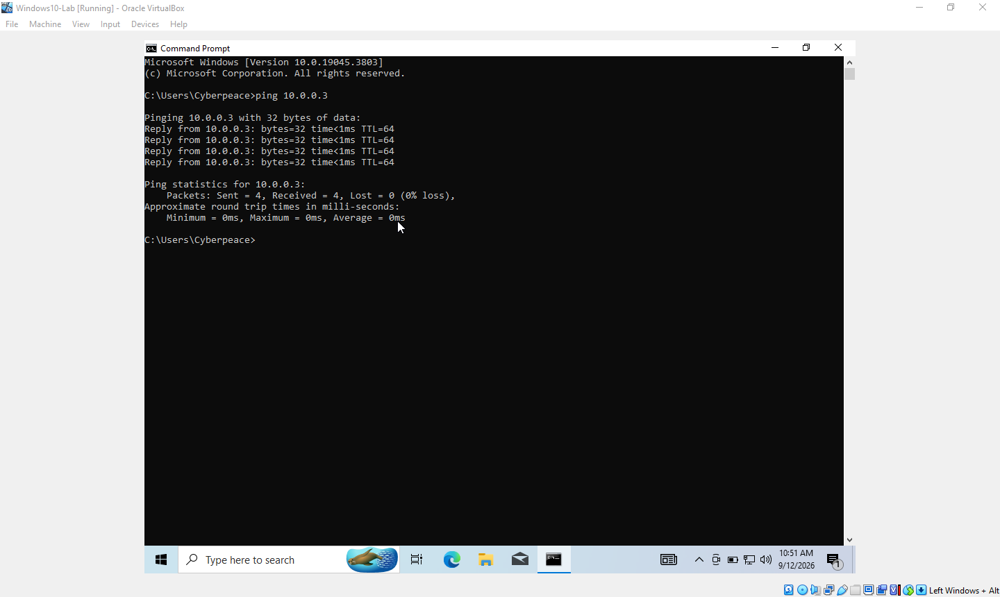
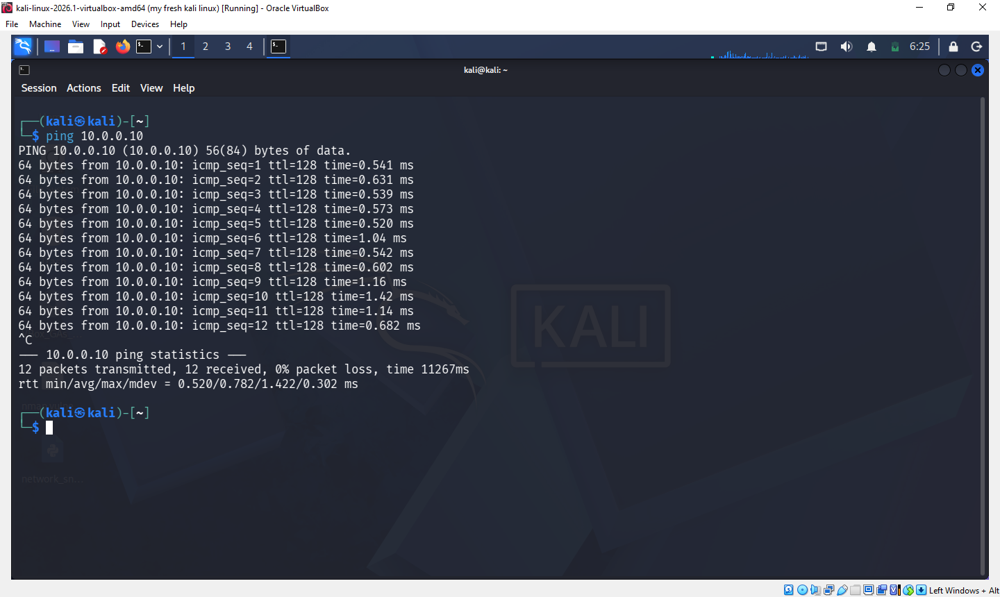

## 🖥️ Week 1 Extra: Windows 10 & Android-x86 VM Networking

### 🎯 Task
Set up Windows 10 and Android-x86 virtual machines in VirtualBox, connect both to the same NAT Network as an existing Kali Linux VM, and confirm bidirectional connectivity (ping) between all three machines.

### ⚙️ Environment
- **Host:** MacBook Air (Boot Camp / Windows)
- **Hypervisor:** Oracle VirtualBox
- **VMs:** Kali Linux, Windows 10, Android-x86 9.0

### 🌐 Network Summary

| Setting        | Value                      |
|----------------|----------------------------|
| Network type   | VirtualBox NAT Network     |
| Kali Linux IP  | 10.0.0.3 (DHCP-assigned)   |
| Windows 10 IP  | 10.0.0.10 (static)         |
| Android 9.0 IP | 10.0.0.9 (static)          |
| Gateway        | 10.0.0.1                   |
| DNS            | 8.8.8.8                    |

### 🛠️ Steps Taken
1. Installed Android-x86 9.0 to a virtual hard disk (MBR partitioning via `cfdisk`, ext4 filesystem, GRUB bootloader).
2. Installed Windows 10 from an ISO built with the Microsoft Media Creation Tool.
3. Set both VMs' network adapters to **NAT Network** (rather than default NAT) so they share a network with the existing Kali VM.
4. Assigned static IPs on the `10.0.0.0/24` network to Windows 10 and Android; Kali retained its DHCP-assigned address.
5. Enabled inbound ICMP (ping) rules in Windows Defender Firewall so Windows would respond to ping requests.
6. Verified connectivity in both directions using `ping` from each VM.

### 🐞 Issues Encountered & Fixes

| Issue | Cause | Fix |
|---|---|---|
| 🖤 Android-x86 boots to black screen | Graphics driver mismatch in VirtualBox | Added `nomodeset` to the GRUB boot line |
| 🔌 VMs couldn't reach each other | Kali's adapter was on default "NAT" (`10.0.2.x`), isolated from the other VMs on "NAT Network" (`10.0.0.x`) | Changed Kali's adapter type to NAT Network in VM Settings |
| 💾 Host ran out of disk space mid-install | Large accumulated files in Downloads plus full VM disk allocations | Cleared Windows temp files/Update cleanup and removed unneeded downloads |
| 🧘 VirtualBox "Guru Meditation" crash | Host ran out of RAM running multiple VMs at once | Reduced per-VM RAM/CPU allocation; avoided running more VMs simultaneously than the host could support |
| 🔥 Kali → Windows ping hung indefinitely | Windows Firewall blocks inbound ICMP by default | Enabled the "File and Printer Sharing (Echo Request - ICMPv4-In)" inbound rule |

### ✅ Result
Confirmed successful two-way ping connectivity between Kali Linux, Windows 10, and Android-x86 virtual machines on a shared VirtualBox NAT Network.

**📱 Android-x86 ↔ Kali Linux:**

**🪟 Windows 10 ↔ Kali Linux:**

